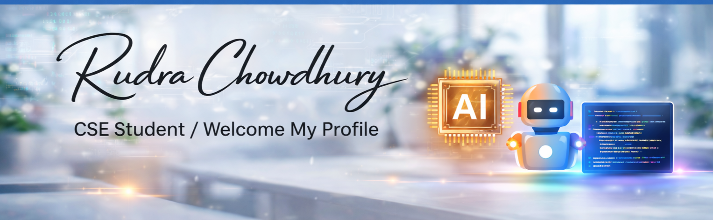

<p align="center">
  
</p>


# 💫 About Me:  


🌍 I'm based in Bangladesh<br>* 🚀  I'm currently working on (LifeDrop app)<br>* 🧠  And learning c programming and c++ both.<br>* 👥  I'm looking to collaborate on App Development<br>* 💬  Ask me about Problem-solving enthusiast<br>* 🤖 - Enjoy building productivity apps and games <br>* 🎮 - Open to new challenges and collaborations <br>*✉️  You can contact me at [rudrachowdhury59@gmail.com]

📊 **this week i spent my time on:**
<!--START_SECTION:waka-->

```txt
TypeScript   7 hrs           ████████████████████▒░░░░   81.32 %
Markdown     38 mins         ██░░░░░░░░░░░░░░░░░░░░░░░   07.37 %
SCSS         18 mins         █░░░░░░░░░░░░░░░░░░░░░░░░   03.67 %
CSS          15 mins         ▓░░░░░░░░░░░░░░░░░░░░░░░░   03.01 %
JSON         11 mins         ▓░░░░░░░░░░░░░░░░░░░░░░░░   02.28 %
```

<!--END_SECTION:waka-->

## 🌐 Socials:
[](https://linkedin.com/in/Rudrachowdhury) [](https://youtube.com/@rudra_7_) [](mailto:rudrachowdhury59@gmail.com) 


<a href="https://linkedin.com/in/Rudrachowdhury" target="blank"></a>
<a href="https://fb.com/rudra" target="blank"></a>
<a href="https://instagram.com/rudra" target="blank"></a>
<a href="https://www.youtube.com/@rudra_7_" target="blank"></a>
</p>


# 💻 Tech Stack:
       

<div align="center">
  
</div
  


### 🌟 Tech & Life Emoji Grid 🚀

|   Code Magic   |    Digital Life    |  Nature & Mood   |   Cosmic Vibes   |
| :------------: | :---------------: | :-------------: | :-------------: |
| 🧠 `think`     | 🎮 `gaming`       | 🌈 `rainbow`    | 🚀 `launch`     |
| 💻 `terminal`  | 🎧 `playlist`     | 🌊 `ocean`      | 🌌 `nebula`     |
| 🔍 `debug`     | 🎨 `design`       | 🌱 `grow`       | ☄️ `comet`      |
| 🛠️ `fix`       | 🎥 `stream`       | ⚡ `energy`     | 🌠 `wish`       |


### ✍️ Random Dev Quote


### 🔝 Top Contributed Repo


---
[](https://visitcount.itsvg.in)


## 🧠 My Learning Workflow (Mermaid)

```mermaid
graph TD
    A[💡 New Idea] --> B[📘 Research / Learn Concept]
    B --> C[✍️ Write Code / Pseudo Code]
    C --> D[🐞 Debug & Test]
    D --> E{✅ Works?}
    E -->|Yes| F[🚀 Deploy / Share]
    E -->|No| C
    F --> G[📈 Improve & Iterate]
    G --> A

